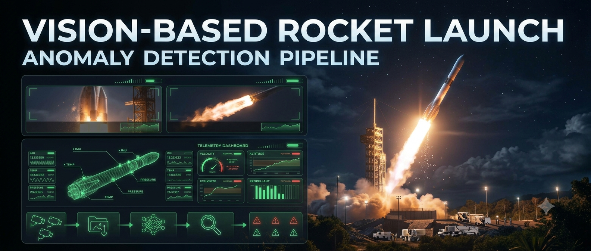
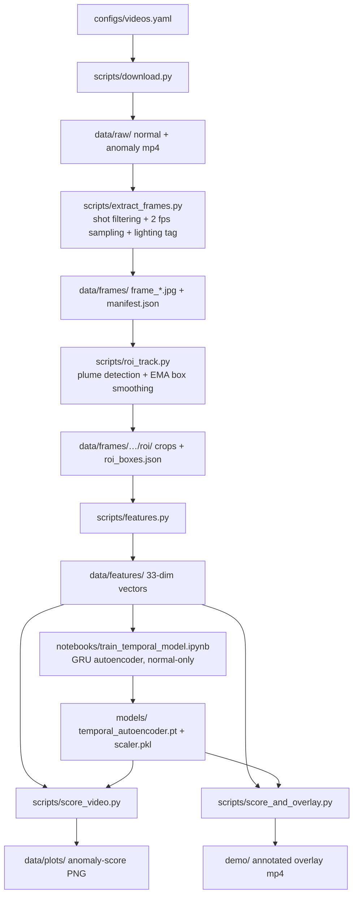
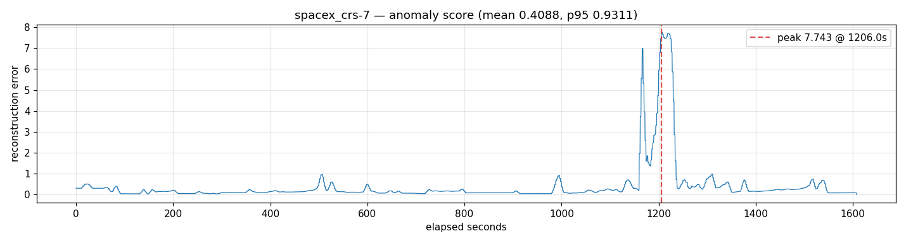
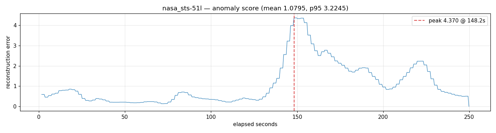
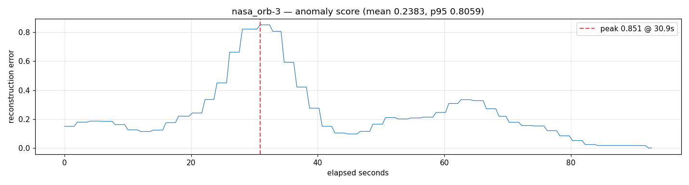

# Rocket Launch Anomaly Detection

Unsupervised video anomaly detection for rocket ascent footage. The system is trained only on normal launch webcasts to learn what a typical ascent looks like, then scores unseen footage by how much it deviates from that learned normal. This is a research/portfolio MVP, not a production system: it demonstrably flags at least one known historical failure cleanly, and it has documented blind spots.

## Overview

No labeled failure dataset exists at scale, and no two failures look alike. So instead of training a classifier to recognize anomaly types, a temporal autoencoder is trained only on *normal* ascent footage: it learns the recurring structure of plume shape, color, debris pattern, and vehicle silhouette. At inference, a frame whose reconstruction error is far above what the model produces for normal video is flagged as anomalous. The model is never shown a failure during training, and nothing in the design assumes balanced classes or failure examples.

## Pipeline

1. **Download** — `scripts/download.py` reads `configs/videos.yaml` and pulls launch webcasts with yt-dlp into `data/raw/{normal,anomaly}/`. `scripts/fetch_launch_list.py` and `scripts/add_video.py` help build the video list.
2. **Frame extraction & shot filtering** — `scripts/extract_frames.py` detects shot/cut boundaries with PySceneDetect, drops shots shorter than 2 s (countdown graphics, rapid cuts), samples the remaining ascent footage at 2 fps, and tags each video's lighting condition (day/dusk/night) so baselines can be trained per lighting.
3. **ROI tracking** — `scripts/roi_track.py` detects the rocket + exhaust plume each frame with a brightness-primary heuristic (Otsu threshold, motion-mask boost, EMA box smoothing) and crops to the ROI with margin. Frames with no confident blob fall back to a full-frame crop and are logged in `roi_boxes.json["fallback_frames"]`.
4. **Feature extraction** — `scripts/features.py` reduces each ROI crop to a 33-dim vector: plume shape statistics, HSV color histogram, edge/debris density, and optical-flow magnitude. Features are KB-scale per frame and cached to disk.
5. **Temporal model** — `notebooks/train_temporal_model.ipynb` trains a GRU autoencoder (window 16, stride 4, latent 32) on feature sequences from normal launches only, minimizing reconstruction MSE.
6. **Scoring & overlay** — `scripts/score_video.py` runs the trained model over a feature sequence and outputs a per-frame reconstruction error (mean MSE over all windows covering each frame). `scripts/score_and_overlay.py` renders an annotated video with a live error chart and a banner that triggers when the score crosses `multiplier × video p95` (default 3×). The chart is scaled to fit the frame, so overlays also work on narrow archival footage (e.g. 320×240).

## Results

All three historical anomaly videos were held out of training; the model was trained on the 13 normal launches only.

**CRS-7 (Falcon 9, 2015) — detected.**

The error curve is clean and isolated. Aside from a minor precursor bump around 1130 s, the score sits on a low, flat baseline (median ~0.13) throughout ascent, breaks sharply upward at ~1160 s, peaks at **7.74 at 1206 s**, holds near that level for roughly a minute, and decays. That peak is ~16× the 95th percentile of all normal-video error (0.49) and ~60× the video's own quiet baseline — an order of magnitude beyond anything the model produces for normal ascent. Timing closely aligns with the known breakup.

**Challenger (STS-51L, 1986) — detected, but noisier.**

The peak error (4.37 at ~148 s into the footage, aligning with the T+73 s breakup) exceeds the largest error observed in any normal video (4.00). But this is a real spike riding on elevated noise rather than a clean isolated rise like CRS-7: the archival footage is lower quality, and ROI tracking fell back to full-frame crops on 105 of 501 frames (21%) where no confident plume blob was found. That noise is high enough that the video's own p95 error (3.22) is not far below its peak, so the default banner threshold (3× p95 = 9.67) sits above the observed maximum and the overlay alarm never fires here — the detection lives in the raw error curve, not in a working alarm. Conversely, a threshold low enough to fire reliably would risk false triggers from the noisy baseline.

**Antares Orb-3 (2014) — missed.**

Peak error (0.85, at 30.9 s into the footage) stayed well inside the normal range — measured stats are p95 0.81 / max 0.85, and the auto threshold (3× p95 = 2.42) exceeds the max, so the overlay renders a video that correctly shows no alarm. The likely reasons: the failure occurred almost immediately after liftoff (~T+15 s), giving the model almost no normal-ascent context to establish a baseline against before the explosion; and a fireball + debris cloud shares enough low-level visual statistics (brightness, color, blob shape) with a normal plume that the current hand-crafted features do not strongly separate them.

The pattern across these three is the real result: **the approach flags failures that develop after ascent is established, and is weak on immediate-liftoff failures.** That is a genuine, reportable limitation, not something to obscure.

## Dataset

- 13 normal launches: SpaceX Starlink / SDA Tranche 0 webcasts, Feb–Sep 2023 (`data/raw/normal/`), 29,597 frames at ~2 fps sampling.
- 3 historical anomaly videos: Challenger (STS-51L), CRS-7, Antares Orb-3 (`data/raw/anomaly/`).
- All sourced from YouTube via yt-dlp; the video files themselves are not redistributed in the repo — only cheap derived artifacts are tracked (feature vectors, plots, model checkpoints, configs).

**Why the video files are excluded.** The raw launch webcasts (the 13 training videos and the 3 anomaly test videos) are large — each full-HD, multi-minute webcast is on the order of hundreds of MB to ~1 GB, and the full set would add many gigabytes to the repository. They are also third-party YouTube content (SpaceX/NASA webcasts) that this project does not own and cannot redistribute. The URLs are recorded in `configs/videos.yaml`, so the videos are regenerable with `python scripts/download.py`; the derived frame crops in `data/frames/` are excluded on the same grounds (reproducible from the raws, and bulkier than the KB-scale feature vectors the model actually consumes).

The normal set is mission- and vehicle-skewed: it is almost all Falcon 9 Starlink launches, split across day/dusk/night but not vehicle-diverse (no Falcon Heavy, Atlas, Electron, etc.). In practice the model has learned "Falcon 9 Starlink ascent." The normal set needs to broaden before any generalization claim is defensible.

## How to run

- GPU-adjacent stages run as Colab notebooks with Google Drive I/O: `notebooks/02_extract_and_track.ipynb` (frame extraction + ROI tracking) and `notebooks/04_extract_features .ipynb` (feature extraction). Expensive intermediates are cached to disk and reused.
- Training and inference run locally on CPU (features are cheap): `notebooks/train_temporal_model.ipynb` produces `models/temporal_autoencoder.pt` + `models/scaler.pkl`; `python scripts/score_video.py data/features/<name>.npy` scores one sequence and writes `data/plots/<name>_anomaly.png`; `python scripts/score_and_overlay.py --video data/raw/anomaly/<name>.mp4` renders the annotated overlay to `demo/<name>_annotated.mp4`.
- Dependencies: `numpy`, `opencv-python`, `torch`, `matplotlib`, `pyyaml`, `scenedetect`, `yt-dlp`; `ffmpeg` on PATH for download merging and AV1/VP9 transcoding.

## Limitations & future work

- **Immediate-liftoff failures (Antares Orb-3).** With no established ascent to compare against, the current features cannot separate a fireball from a plume. Possible fixes: liftoff-phase-normal training data, or features that capture explosion dynamics (expansion rate, debris trajectories) rather than static appearance.
- **Thin normal-set diversity.** Nearly all Falcon 9 Starlink. The model's notion of "normal" is bounded by what the training set happens to contain.
- **Hand-crafted features.** Shape/color/edge/flow are classical CV. Learned embeddings (e.g., a CNN encoder over the same ROI crops) are the natural next step if these features prove insufficient for fireball-like anomalies.
- **Per-video-relative thresholding.** With the default `3× p95`, the banner fires only on CRS-7 (threshold 2.79 vs peak 7.74). On Challenger (9.67 vs max 4.37) and Orb-3 (2.42 vs 0.85) the threshold sits above the observed maximum, so no alarm triggers — even on Challenger, where the curve clearly exceeds every normal video. Baseline noise directly inflates the per-video p95, so this mechanism needs an absolute threshold fit to the normal population (or a noise-aware variant) to be operationally useful.
- **Offline only.** This scores recorded video; there is no real-time/streaming deployment.
